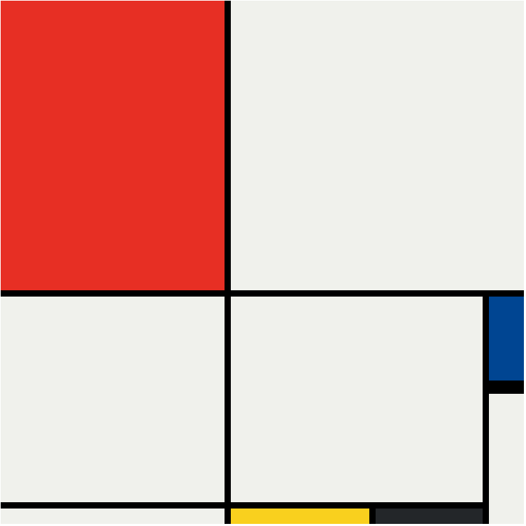

<h1 align="center">Mondrian painting</h1>
  
Project for learning CSS grid.

 
 

## What is this project about?
Piet Mondrian composition created using CSS grid.
 
 

## Technologies used
- HTML
- CSS
- GIT
 

## What have I learned?
- CSS grid layout system
 
 

*project was based on [Web Development Course](https://www.udemy.com/course/the-complete-web-development-bootcamp/)

